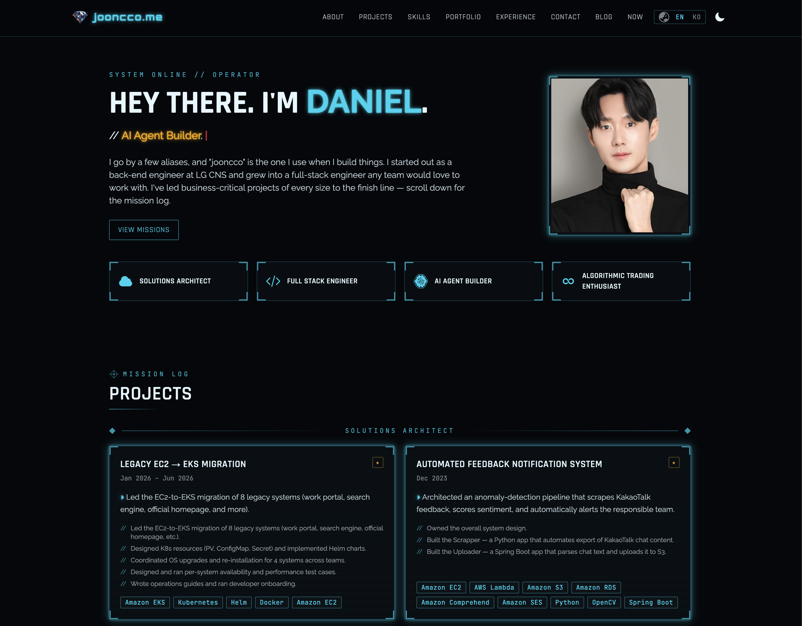
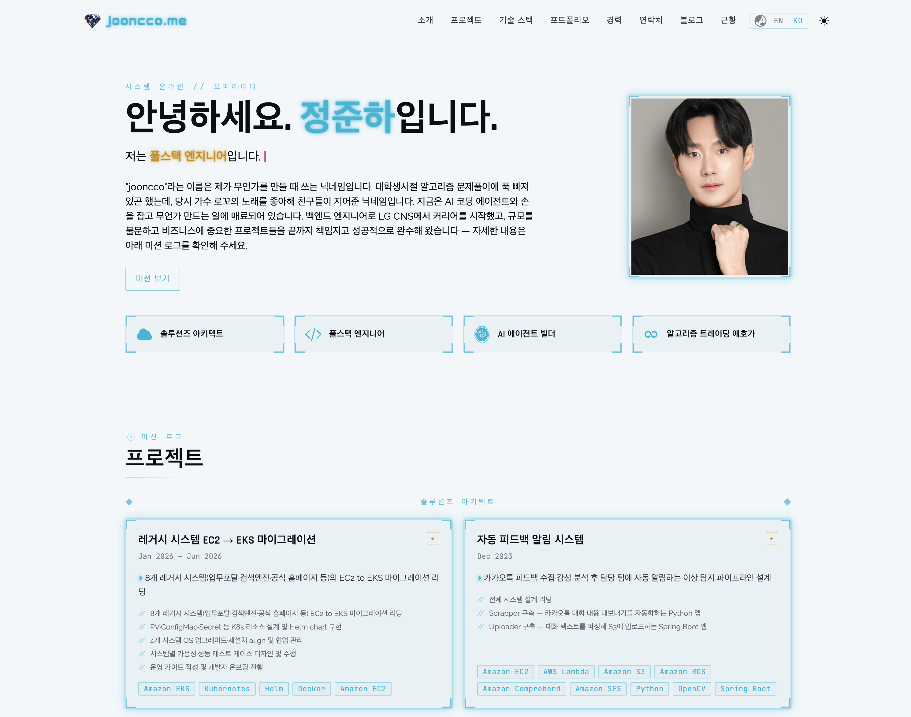

# blog.me

<figure style="display: flex; gap: 20px;">
    
    
</figure>

A distinctive **Iron Man / high-tech HUD** developer portfolio **and bilingual (EN/KO) MDX blog**, built with **Next.js 15 (App Router) + TypeScript**, Tailwind CSS, Material Tailwind, and three.js. Live demo: [jooncco.me](https://jooncco.me).

This is a [GitHub template repository](https://docs.github.com/en/repositories/creating-and-managing-repositories/creating-a-repository-from-a-template) — all personal content lives in `data/*`, `messages/*`, and `content/blog/**`, so you can rebrand it **without editing components**. If it helps you, a star ⭐ is appreciated.

## Features

- **HUD design system** — cyan/red/gold palette, glow/scanline effects, light + dark themes with a persisted toggle.
- **Home sections** — About, Projects (expertise-grouped), Skills, Portfolio, Competitive Programming, Experience timeline, and blog highlights. Plus a `/now` page and a `/contact` page with a lazy-loaded 3D scene.
- **Bilingual blog** — MDX posts under `content/blog/**` with per-locale files (`<slug>.en.mdx` / `<slug>.ko.mdx`), categories/tags, math (KaTeX), syntax highlighting, and automatic fallback to the other language with a disclaimer banner.
- **Competitive Programming snapshot** — LeetCode + Codeforces stats served from a cached snapshot (with graceful fallbacks) instead of a live fetch on every render.
- **SEO-first** — per-page metadata, canonical URLs, `hreflang` alternates (en/ko/x-default), OpenGraph + Twitter cards, JSON-LD (Person / WebSite / BlogPosting), `sitemap.xml`, and `robots.txt`.
- **Security hardening** — CSP + HSTS + `X-Content-Type-Options` / `X-Frame-Options` / `Referrer-Policy` headers, env-sourced secrets, validated contact form, fail-safe external calls.
- **Tooling** — strict TypeScript, Vitest + Testing Library, ESLint/Prettier, and a GitHub Actions CI pipeline (lint → typecheck → test → build → audit).

## Tech stack

Next.js 15 (App Router, RSC) · React 18 · TypeScript (strict) · Tailwind CSS + Material Tailwind · next-intl (i18n) · next-mdx-remote + gray-matter (blog) · @react-three/fiber + drei (3D) · EmailJS (contact) · Vitest.

## Getting started

```bash
git clone https://github.com/jooncco/blog.me.git
cd blog.me
npm install
cp .env.example .env.local   # then fill in the values (see below)
npm run dev                   # http://localhost:3000
```

### Scripts

| Command | Purpose |
|---|---|
| `npm run dev` | Start the dev server |
| `npm run build` | Production build (static-optimized) |
| `npm start` | Serve the production build |
| `npm run lint` | ESLint |
| `npm run typecheck` | `tsc --noEmit` |
| `npm test` | Run the Vitest suite |
| `npm run migrate:blog` | Import posts from a Jekyll source into `content/blog/**` |

## Environment variables

All variables are **client-exposed** (`NEXT_PUBLIC_*`) by design for this static site, but are sourced from the environment rather than hardcoded (see `lib/env.ts`). Copy `.env.example` → `.env.local` and fill in:

| Variable | Description |
|---|---|
| `NEXT_PUBLIC_EMAILJS_SERVICE_ID` | EmailJS service id (contact form) |
| `NEXT_PUBLIC_EMAILJS_TEMPLATE_ID` | EmailJS template id |
| `NEXT_PUBLIC_EMAILJS_PUBLIC_KEY` | EmailJS public key |
| `NEXT_PUBLIC_CONTACT_TO_EMAIL` | Where contact messages are delivered |
| `NEXT_PUBLIC_CONTACT_TO_NAME` | Display name for the recipient |
| `NEXT_PUBLIC_LEETCODE_USERNAME` | LeetCode handle for the CP snapshot |
| `NEXT_PUBLIC_CODEFORCES_USERNAME` | Codeforces handle for the CP snapshot |

Missing values degrade gracefully (the contact form disables sending, CP stats fall back to `data/cp-fallback.ts`) — the build stays green and only logs a warning.

## Rebranding (make it yours)

You should never need to touch component code. Edit these instead:

1. **Section content → `data/*.ts`**
   - `data/about.ts` — capabilities/order, avatar path
   - `data/projects.ts` — projects grouped by expertise domain
   - `data/skills.ts` — skill categories/tools
   - `data/portfolio.ts` — portfolio items + categories
   - `data/experience.ts` — experience timeline
   - `data/now.ts` — `/now` page items
   - `data/cp-fallback.ts` — fallback CP stats if the snapshot is unavailable

2. **All display strings → `messages/*`** (structure is content, copy is i18n)
   - `messages/{en,ko}.json` — shell (nav, footer, theme, locale, common)
   - `messages/sections.{en,ko}.json` — home sections (namespace `sections`)
   - `messages/blog.{en,ko}.json` — blog UI (namespace `blog`)

3. **Blog posts → `content/blog/**`**
   - One file per locale: `my-post.en.mdx`, `my-post.ko.mdx` (either may be omitted; the other is served with a fallback banner).
   - Front-matter: `title`, `date`, `lastModified?`, `category`, `tags`, `teaser?`, `ogImage?`.
   - Images live under `public/blog/images/**` and are referenced with absolute paths.
   - To bulk-import from a Jekyll site, run `npm run migrate:blog` (see `scripts/migrate-blog.ts`).

4. **Identity & links**
   - Social profiles: `components/shell/config.ts` (`SOCIAL_LINKS`).
   - JSON-LD Person / `sameAs`: `lib/seo/jsonLd.ts` (`PERSON`).
   - Canonical site URL: `lib/seo/metadata.ts` (`SITE_URL`) and `metadataBase` in `app/[locale]/layout.tsx`.

5. **Static assets**
   - `public/assets/images/logo.png`, `public/assets/images/about/profile.jpg`
   - `public/preview_dark.png` / `public/preview_light.png` (the default social-share image is `preview_dark.png`)
   - `app/opengraph-image.jpg`, `app/icon.png`, `app/apple-icon.png`, `app/favicon.ico`

## SEO & security

- **SEO** is centralized in `lib/seo` (`buildMetadata`, JSON-LD builders) and consumed by every route's `generateMetadata`; `app/sitemap.ts` and `app/robots.ts` enumerate all locale × page/post URLs. Update `SITE_URL` to your own domain.
- **Security headers** (CSP, HSTS, `X-Frame-Options`, etc.) are set in `middleware.ts`. The CSP allowlists `self` plus EmailJS/LeetCode/Codeforces for the features that call them; `'unsafe-inline'` for styles is required by Material Tailwind + KaTeX and is documented inline.
- **Dependency audit**: `npm audit` runs in CI. A few advisories remain that are only fixable via breaking major upgrades of dev tooling (Vitest/Vite/esbuild) or of `next` / `next-intl` / `next-mdx-remote`; they are not exploitable in this static, no-auth, trusted-local-MDX setup and are intentionally not force-upgraded.

## Deployment

Deploy on [Vercel](https://vercel.com/) with the standard Next.js pipeline. Set the environment variables above in the project settings. The build is fully static/ISR — no server or database required.

## License

MIT License — Copyright (c) 2023 JunHa Jeong. See [LICENSE](./LICENSE).
